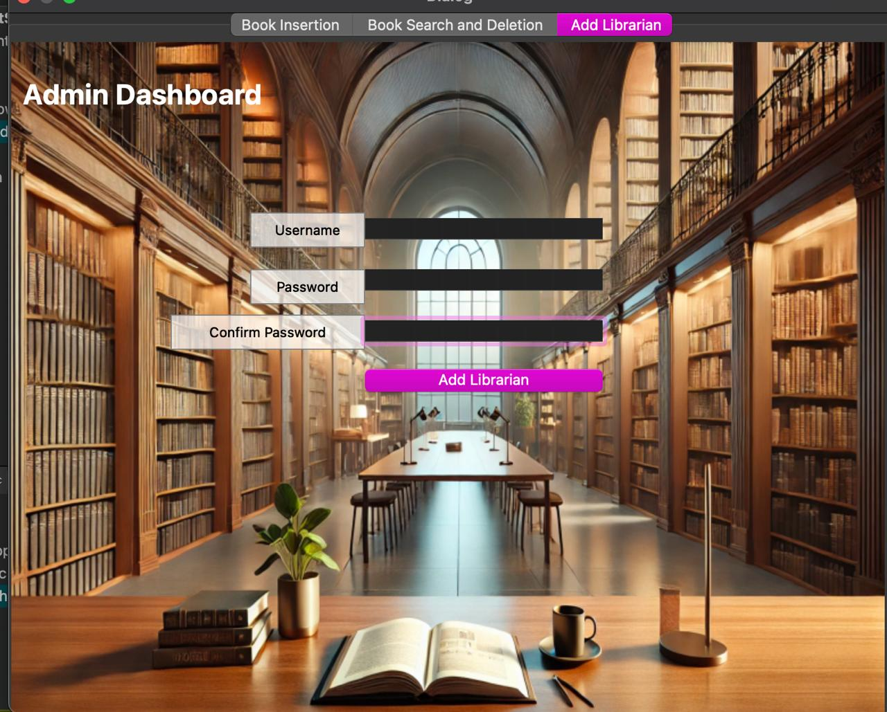

# 📚 Library Management System – Qt C++ Application

An advanced, fully-featured **Library Management System** built using **C++ and the Qt framework**, featuring custom-built data structures, efficient trie-based search, persistent storage via CSV, and dynamic, role-specific graphical user interfaces.

---

## 🧠 Project Overview

This system manages library operations through three distinct user roles — **Admin**, **Librarian**, and **User** — each with its own interface and set of permissions. It supports book inventory management, advanced search functionality using a trie, request handling, and persistent login authentication with encrypted credentials.

---

## ✨ Key Features

- 🔍 **Trie-Based Book Search**  
  Fast, efficient keyword search across book titles, authors, genres, and ISBNs using a character trie with multi-keyword support and intersection logic.

- 👤 **Role-Based Access Control**
  - **Admin**: Add/remove books and search inventory.
  - **Librarian**: Approve or deny user book requests.
  - **User**: Search, borrow, return books, and manage wishlists.

- 💾 **CSV-Based Data Persistence**  
  All data (users, books, requests) is stored in CSV files and loaded into memory at runtime via custom file management classes.

- 🧰 **Custom Data Structures**
  - **Vector**: Custom-built dynamic array (similar to `std::vector`) with iterator support and debug logging.
  - **Trie**: Character-level search tree that maps words to associated book records.

- 🔐 **Encrypted Login System**  
  Credentials are stored securely with XOR-based encryption.

- 🖼️ **Rich Qt GUI**
  Built using Qt Widgets (QDialog, QListWidget, QPushButton), with polished styling using QPixmap and QSS themes.

---

## 🔧 Core Components

### 🧮 Data Structures

#### ✅ Vector Class
- **Custom Implementation** to replace `std::vector`, tailored for performance and control.
- Supports methods: `push_back`, `pop_back`, `erase`, `find`, `clear`.
- Includes `QDebug` logging for internal operations like copying, resizing.
- Used to store book pointers, admin data, and user accounts.

#### 🔡 Trie Class
- **Optimized Keyword Indexing** over 37-character space: a–z, 0–9, and `-`.
- Ignores special characters, indexes lowercase tokens from book metadata.
- Multi-keyword intersection search ensures relevant results.
---

## 🧑‍💼 User Roles

### 👑 Admin
- Add/Remove books, manage stock via UI components.
- Search books using Trie.
- Add/Remove Librarians

### 📚 Librarian
- Handles requests for books (`book_request_info.csv`).
- Approves/Dismisses borrow requests with timestamped logs.
- UI reflects active user requests, real-time updates to CSVs.

### 👤 User
- Search, borrow, return books.
- Wishlist management.
---

## 💾 Data Management

### 📂 filemanipulator Class
- Handles reading/writing: `books_info.csv`, `users_info.csv`, `book_request_info.csv`.
- Supports encrypted password storage with XOR cipher.
- Uses static vectors (`books_vector`, `the_users_data_vector`) to sync state with UI.
- File structure (book entry):  
  `"The Great Gatsby","F. Scott Fitzgerald","Fiction;Classics",5,"9780743273565","101"`

### 📖 book Class
- Breaks down book metadata into searchable keywords for Trie insertion.
- Ensures consistent indexing of entries like `"The-Hobbit"` into `"the"`, `"hobbit"`.
- Automatically reflects changes in inventory and UI.

---

## 🧪 Performance

### ✅ Trie-Based Search
- **Time complexity**:  
  - Insertion: `O(k)` such that k is average word length. 
  - Multi-keyword search: fast intersection-based matching.

---

## 📸 Screenshots

  
*Library Management System - Admin View*

  
*Library Management System - Librarian View*

  
*Library Management System - User View*

---

## 👥 Team Contributors

**Mahmoud Afifi** | **Ziad Abdelmoatti**  |  **Mohamed Amer**  | **Omar Rabeh**| **Moaz Allam**     

---

## 📬 Contact

For questions, feedback, or contributions, feel free to reach out:

📧 **mahmoudhossam@aucegypt.edu**

---
